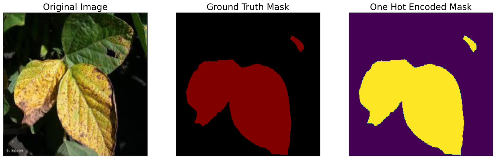
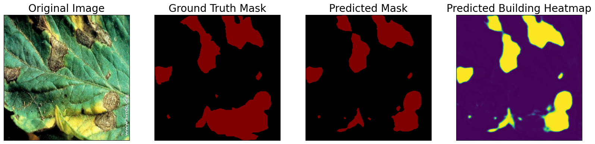
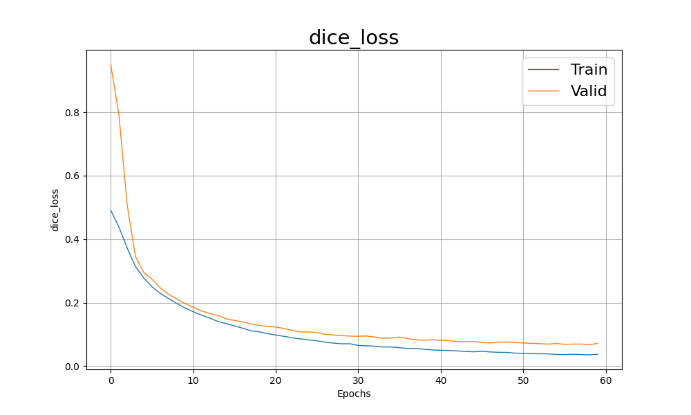
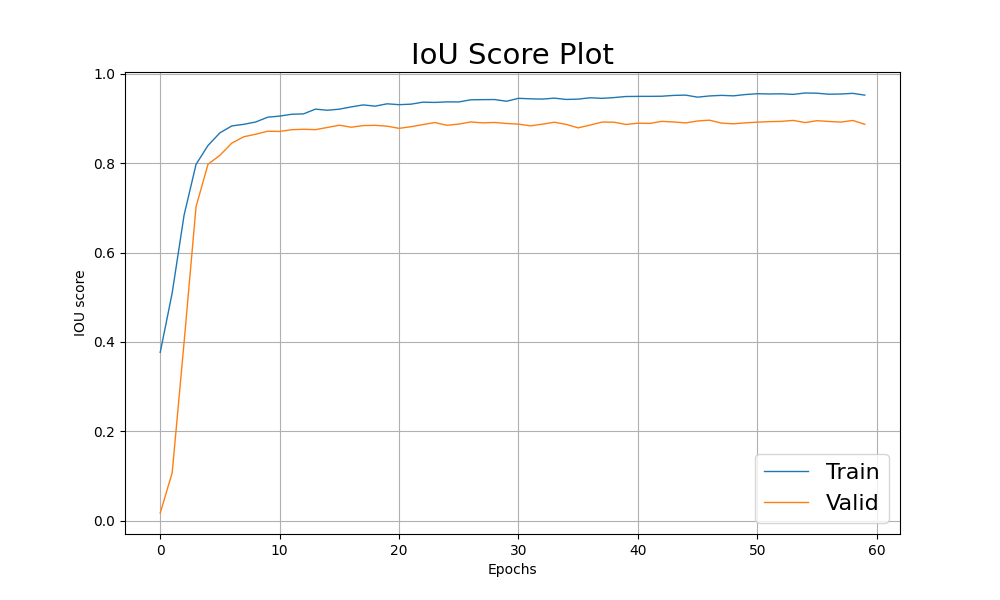

# 🍃 Leaf Disease Segmentation

This project focuses on **segmenting leaf diseases** from plant images using deep learning and image augmentation techniques. The goal is to help with early detection and classification of plant diseases, which can support precision agriculture and reduce crop loss.

## 📁 Project Structure


    ├── Leaf_disease_segmentation/ 
    ├── orig_data/ 
    │           ├── train_images/ 
    │           └── train_masks/ 
    │           └── test_masks/ 
    │           └── test_images/ 
    ├── models save/
    │           └── Best model/ 
    │           └── Last model/ 
    ├── Loss curve
    ├── IOU curve
    ├── Sample prediction/
    │           └── 1.
    │           └── 2................
    ├── train_test notebook
    ├── README file


## 🧠 Objectives

- Detect and segment diseased regions on plant leaves.
- Train and evaluate a segmentation model (e.g., U-Net, DeepLabV3).
- Utilize Albumentations for advanced data augmentation.
- Ensure consistent preprocessing via padding, resizing, etc.

## 🧰 Tools & Libraries

- Python 3.x
- PyTorch
- Albumentations
- OpenCV
- Matplotlib / Seaborn
- scikit-learn
- segmentation_models_pytorch

## 🖼️ Data Pipeline

1. **Data Augmentation** using `albumentations`:
   - `OneOf` (flip/rotate)
   - `PadIfNeeded`
   - `RandomBrightnessContrast`
   - `GaussianBlur`

2. **Preprocessing**:
   - Image reading using OpenCV
   - RGB conversion
   - Resizing / Padding
   - Normalization (optional)

3. **Segmentation Model**:
   - Architecture: U-Net or DeepLabV3+
   - Loss Function: Dice loss, BCE loss, or a combination
   - Metrics: IoU, Dice score

4. **Evaluation**:
   - Visual comparison between predicted mask and ground truth
   - Metric scores on test set

## 🚀 How to Run

```bash
# Clone the repo
git clone https://github.com/your_username/leaf-disease-segmentation.git
cd leaf-disease-segmentation

# Install requirements
pip install -r requirements.txt

# Run a training script or Jupyter notebook
jupyter notebook notebooks/train_test.ipynb

```
Architecture are taken from https://smp.readthedocs.io/en/latest/models.html
. And dataset from [kaggle](kaggle.com)
### Example of dataset:



##  Visual Results 
Sample test result of a image


Evaluation on test data:

### Mean IoU score:  0.9006
### Mean IoU Loss:  0.0663

### Loss curve






## 🧩 Future Improvements
Add disease classification after segmentation

Try transformer-based models (e.g., SegFormer)

Improve generalization with more diverse data

Deploy as a web app or mobile tool
